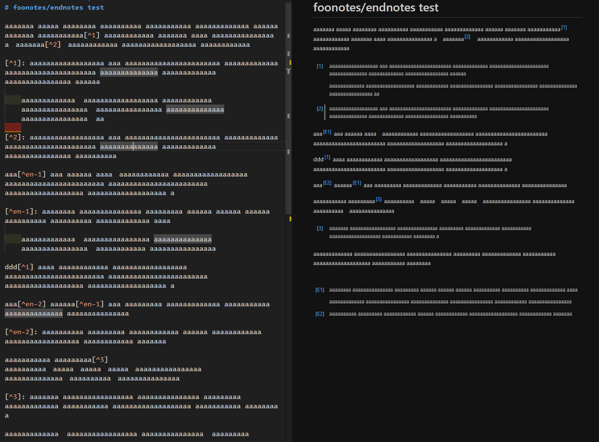

# vsce-p7d-markdown-it-footnote-here

This extension inserts footnotes just below paragraph in VS Code's built-in markdown preview.

The input Markdown and the output HTML are as follows.

You write the following Markdown.

```md
A paragraph.[^1]

[^1]: A footnote.

A paragraph.
```

In VS Code's built-in markdown preview, the value of the class attribute is added as follows.

```html
<p>A paragraph.<a href="#fn1" id="fn-ref1" class="fn-noteref" role="doc-noteref">[1]</a></p>
<aside id="fn1" class="fn" role="doc-footnote">
<p><a href="#fn-ref1" class="fn-backlink" role="doc-backlink">[1]</a> A footnote.</p>
</aside>
<p>A paragraph.</p>
```

This extension has a simple CSS to layout the footnotes.



---

You can also use endnotes by prefixing the label with `en-`. Endnotes are collected into a single section at the end of the preview.

```md
This is an endnote.[^en-1] Another endnote appears later.[^en-2]

[^en-1]: First endnote.
[^en-2]: Second endnote.

Conitune the main text.
```

Endnotes HTML example:

```html
<p>This is an endnote.<a href="#en1" id="en-ref1" class="en-noteref" role="doc-noteref">[E1]</a> Another endnote appears later.<a href="#en2" id="en-ref2" class="en-noteref" role="doc-noteref">[E2]</a></p>
<p>Conitune the main text.</p>
<section id="endnotes" role="doc-endnotes" aria-label="Notes">
<ol>
<li id="en1">
<p><a href="#en-ref1" class="en-backlink" role="doc-backlink">[E1]</a> First endnote.</p>
</li>
<li id="en2">
<p><a href="#en-ref2" class="en-backlink" role="doc-backlink">[E2]</a> Second endnote.</p>
</li>
</ol>
</section>
```

---

Notice. You can remove the CSS that this extension applies by checking "P7d Markdown It Footnote Here: Disable Style" of the user settings.

---

## Settings

This extension exposes all options from `@peaceroad/markdown-it-footnote-here` under the `p7dMarkdownItFootnoteHere.*` settings.
It also provides these extension-specific settings:

- `p7dMarkdownItFootnoteHere.disableBuiltinFootnotes` (default: false). When false, this extension disables VS Code's built-in footnote processing for the markdown-it instance used by this extension. Set it to true only if you want to keep the built-in rules enabled.
- `p7dMarkdownItFootnoteHere.disableStyle` (default: false). Disables the bundled CSS.

Most string options are empty by default in the settings UI. When left empty, this extension uses the plugin defaults, including:

- `afterBacklinkContent`: `\u21A9` (U+21A9)
- `afterBacklinkdAriaLabelPrefix`: `Back to reference `
- `labelBra`/`labelKet`: `[` and `]`
- `backLabelBra`/`backLabelKet`: `[` and `]`
- `endnotesPrefix`: `en-`
- `endnotesLabelPrefix`: `E`
- `endnotesSectionId`: `endnotes`
- `endnotesSectionAriaLabel`: `Notes`
